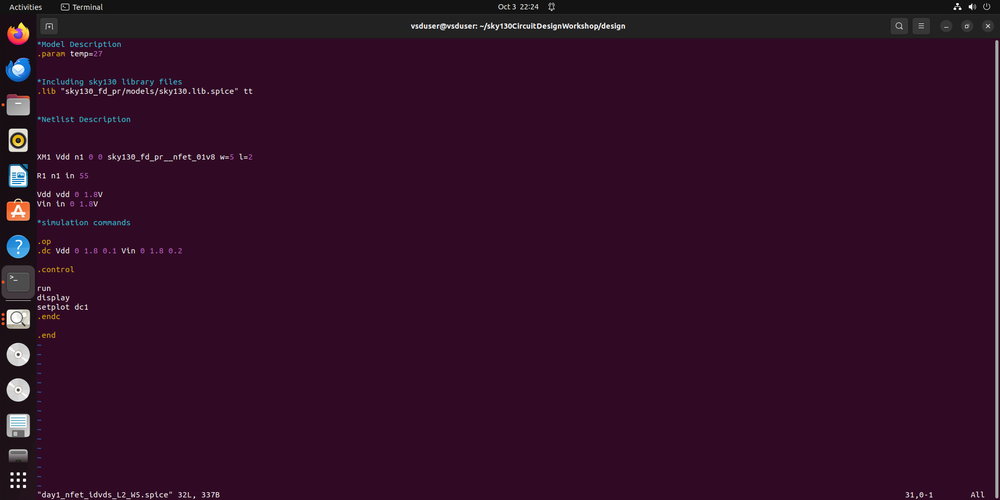
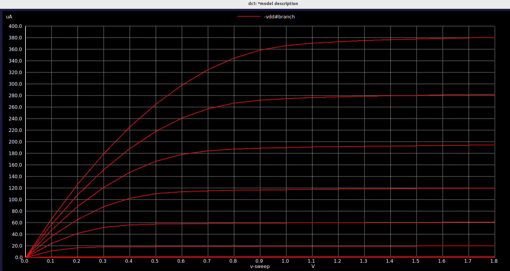
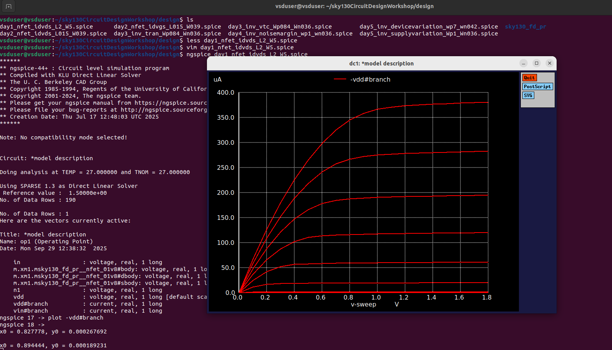
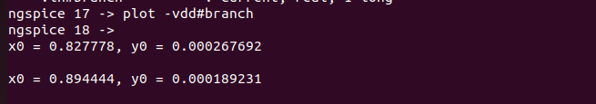

# 📘 CMOS Project – Day 1 Report

Welcome to my Day 1 notes from the **CMOS Project**.  
This repo captures my learnings, simulations, and lab activities.

---

## 🔹 Understanding MOSFET Operation

### Threshold Voltage & Body Effect
- An extra potential **V1** is required in the second scenario for strong inversion due to positive **Vsb**.  
- **Vto** is a function of device parameters.  
- Threshold Voltage (**VTH**) = minimum voltage required for strong inversion.  
- With additional **body voltage**, charges present in the channel are pulled to the source.  
- Positive body voltage between source and body disturbs channel formation, requiring more voltage for inversion.

### Constants & SPICE Models
- Constants are model information from the foundry (📦 **technology models**).  
- SPICE uses these models to evaluate **VT**.  
- The **VT equation** represents the MOSFET.

---

## 🔹 Modes of MOSFET Operation

1. **Cutoff Mode** → Below threshold, transistor is OFF.  
2. **Resistive/Linear Mode** → VDS < VGS – VT.  
3. **Saturation Mode** → VDS ≥ VGS – VT.  

### Strong Inversion
- The surface of a **p-substrate** becomes **n-type** once threshold voltage is applied.  
- Increasing **VGS** adds more charge carriers, creating a wider conducting channel.  

### Channel Conditions
- Voltage along the channel varies with **VDS**.  
- For inversion to happen:  
  **VGS – VDS ≥ VTH**  

### Pinch-Off & Saturation
- Pinch-off ≠ current stops.  
- Near the drain, the channel vanishes, but conduction still happens near the source.  
- In saturation, **Id** becomes ideally independent of **VDS**.  
- Effective channel length reduces as VDS increases beyond a limit.  
- Drain current appears constant (function of model constants).

---

## 🔹 SPICE Basics 🧪

**What is SPICE?**  
A simulation engine with predefined models.  
We provide:
- **Netlist**  
- **Technology file**  
- **Model parameters**

It outputs waveforms of current/voltage → used to calculate **cell delays** (important for **STA**).

### Steps for Simulation
1. **Create Nodes**  
   - Example: `M1` represents a MOSFET  
   - Order: **Drain, Gate, Source, Substrate**

2. **Define Technology File**  
   - Model parameters (`nmos`, `pmos`) must match circuit description.  
   - Packaged into `.mod` file.  

3. **Simulation Commands**  
   - Sweep **VDS** to get **Id vs VDS** curve.  
   - Manual calculation gives only a single point → SPICE automates across ranges.

---

## 🔹 Day 1 Lab 

We used **Ubuntu** to explore the `less` command (a pager to view text files one screen at a time).  

### Commands

less filename
less /etc/passwd
Navigation Shortcuts
Spacebar → Next page

b → Previous page

Enter → Scroll down one line

y → Scroll up one line

G → End of file

g → Start of file

/pattern → Search forward

?pattern → Search backward

n / N → Repeat search

q → Quit

🔹 Graphical Analysis 📊
Plotted Id vs VDS for various VGS values.

Very small current when VGS < VT (device OFF).

🧑‍🔬 Lab Session Theory & Screenshots
📖 Lab Theory

📸 Lab Screenshots

Day1/images/1.png

✅ Summary
Learned MOSFET modes & body effect.

Explored SPICE modeling and simulation steps.

Practiced Linux command less.

Generated plots of Id vs VDS.

Documented lab theory and included screenshots.

✨ End of Day 1 – Onwards to deeper CMOS adventures! 🚀

yaml
Copy code

