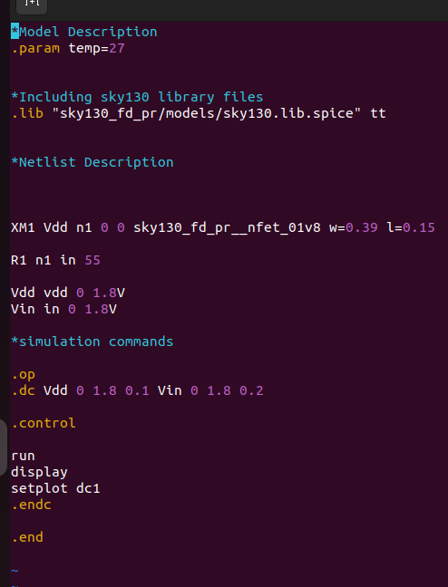
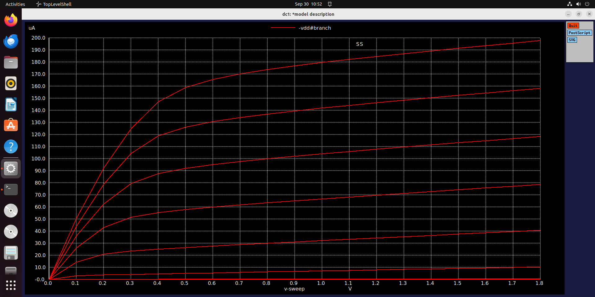
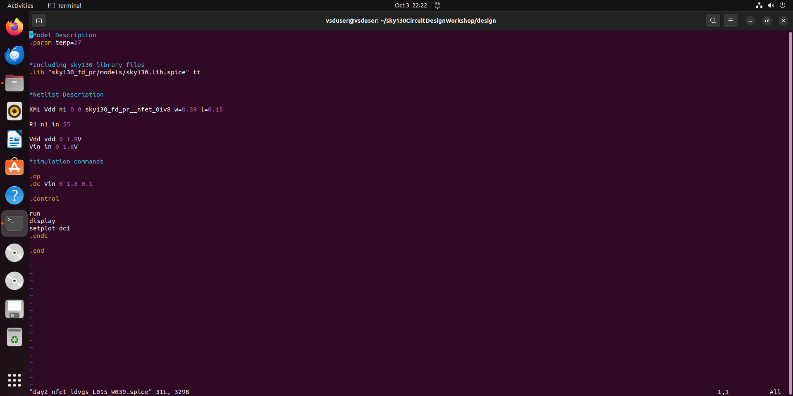
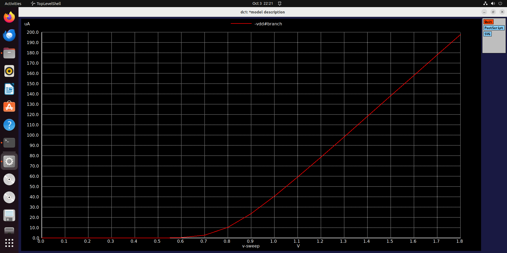

# 📘 CMOS Project – Day 2 Report

This is my Day 2 log for the CMOS Project. The focus was on understanding MOSFET behavior in the linear region, the impact of channel length scaling, velocity saturation, and the fundamentals of the CMOS inverter. Both theoretical analysis and lab observations were combined to strengthen the concepts. 
  

---

## 🔹 MOSFET Drain Current Equation

The drain current in the linear (or triode) region of a MOSFET is given by:

At small values of VDS, the quadratic term 
𝑉
𝑑
𝑠
2
/
2
V
ds
2
	​

/2 becomes negligible, and the drain current shows almost linear dependence on VDS. Although mathematically this equation is nonlinear (due to the quadratic term and the bilinear product 
, in device physics it is still referred to as the linear region because the MOSFET behaves like a voltage-controlled resistor for small VDS values.

An important observation is that if the width-to-length (W/L) ratio remains constant, the expectation is that drain current should not change. However, in modern smaller technology nodes, even with the same W/L, reducing the channel length modifies the drain current due to short-channel effects.

✅ **Key point:** Mathematically nonlinear, but in device physics called *linear/ohmic region*.

---

## 🔹 Long vs Short Channel Behavior

The difference between long-channel and short-channel devices was clearly seen in the current–voltage characteristics.

For long-channel MOSFETs (1.2 μm), the drain current has a quadratic dependence on the gate voltage (VGS) at a fixed drain voltage (VDS).

For short-channel MOSFETs (0.25 μm), the drain current is quadratic only for small VGS values, but becomes linear at higher VGS. This behavior is explained by velocity saturation, a phenomenon where at high electric fields, carrier velocity stops increasing linearly with field and instead becomes constant.

Thus, in addition to the standard cutoff, linear, and saturation regions, short-channel devices have a fourth region of operation called velocity saturation.

Another key observation was that when the gate overdrive (VGT) is minimum, VDS and VDSAT become larger, forcing the device into saturation. Conversely, at minimum VDS, the peak drain current reduces.

- **Long Channel (1.2 μm):**  
  - Drain current shows **quadratic dependence** on VGS at a fixed VDS.  

- **Short Channel (0.25 μm):**  
  - Quadratic only at small VGS.  
  - At higher VGS, **linear dependence** due to **velocity saturation**.  

### Velocity Saturation
- At low electric fields: velocity ∝ electric field.  
- At high fields: velocity becomes constant.  
- For short-channel MOSFETs, there is an **extra mode of operation**:  
  - **Velocity Saturation Region** (beyond cutoff, linear, and saturation).  

---

## 🔹 MOSFET Current Models

- At lower technology nodes, drain current depends not only on W/L ratio.  
- Even with same W/L, reducing channel length alters current.  
- Drain current ∝ quadratically with VGS (long channel).  
- Drain current ∝ linearly with VGS (short channel at higher fields).  

---

## 🔹 Lab Activity – Id vs VDS (Short Channel)

- Observed **linear behavior** at small VDS.  
- Peak current reduces as VDSmin increases.  
- ID vs VGS used to extract **VTH**:  
  - Extrapolate Id–Vgs curve back to x-axis.  
  - Example: **VTH ≈ 0.77 V**.  

---

## 🔹 MOSFET as a Switch – CMOS Inverter

- **CMOS = Complementary MOS (PMOS + NMOS):**  
  - PMOS on top (source → VDD).  
  - NMOS at bottom (source → VSS).  
  - Gates tied together (Vin).  
  - Drains tied together (Vout).  

### Voltage Transfer Characteristics (VTC)
- Based on **Vin vs Vout**.  
- Thresholds of NMOS and PMOS differ (electron vs hole mobility).  
- Simplified analysis: only track **Vin and Vout**.  

### CMOS INVERTER FUNDAMENTALS

The CMOS inverter was introduced as the basic building block of digital circuits. It is called complementary MOS because it uses both an NMOS and a PMOS device:

The PMOS is placed at the top with its source tied to VDD.

The NMOS is placed at the bottom with its source connected to ground (VSS).

The gates of both devices are connected to the input (Vin).

The drains are connected together to form the output node (Vout).

The load capacitance (CL) may be the input of another MOSFET stage or interconnect wire.

The voltage transfer characteristics (VTC) of the inverter describe the relationship between Vin and Vout. These are purely voltage-based, which is why digital circuits are modeled primarily in terms of voltages rather than currents. The threshold voltages of NMOS and PMOS differ due to the difference in electron and hole mobilities.

To simplify the analysis, all intermediate voltages are ignored, and only Vin and Vout are tracked. For a long-channel device, VDD was assumed as 2V for demonstration, but the same principles apply to smaller technology nodes.

When Vout = 0, a finite current still flows because the output capacitance must be charged. The current through PMOS and NMOS differs, and their load curves are merged to form the overall CMOS inverter characteristic. This forms the basis for understanding propagation delay and inverter switching behavior.
Current in CMOS Inverter
- At Vout = 0 → finite current (needed to charge output capacitance).  
- PMOS and NMOS curves differ → combine to get **load curve**.  
- Merging NMOS + PMOS load curves gives complete CMOS VTC.  

---
## ✅ Lab observations

In the lab session, the Id vs. Vds curve for short-channel devices demonstrated near-linear behavior, validating the velocity saturation concept. Similarly, from the Id vs. Vgs plot, the threshold voltage (VTH) of the device was extracted by extrapolating the current back to the x-axis, which gave a value of approximately 0.77 V.

This threshold voltage is very important in CMOS design because it directly influences the delay of logic cells, highlighting the link between device characteristics and circuit performance.

## ✅ Summary of Day 2
- Derived MOSFET drain current in **linear region**.  
- Understood **short vs. long channel differences** (velocity saturation effect).  
- Extracted **VTH from Id–Vgs plot (~0.77 V)**.  
- Analyzed **CMOS inverter basics** (PMOS on top, NMOS on bottom, complementary action).  
- Explored **VTC characteristics** and load curves.  

---

