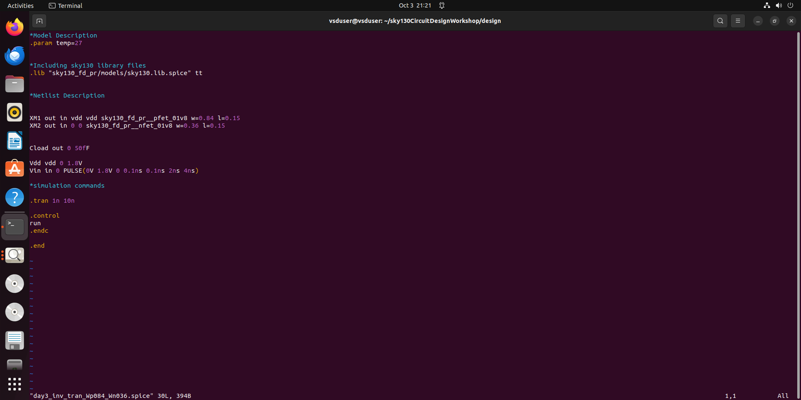
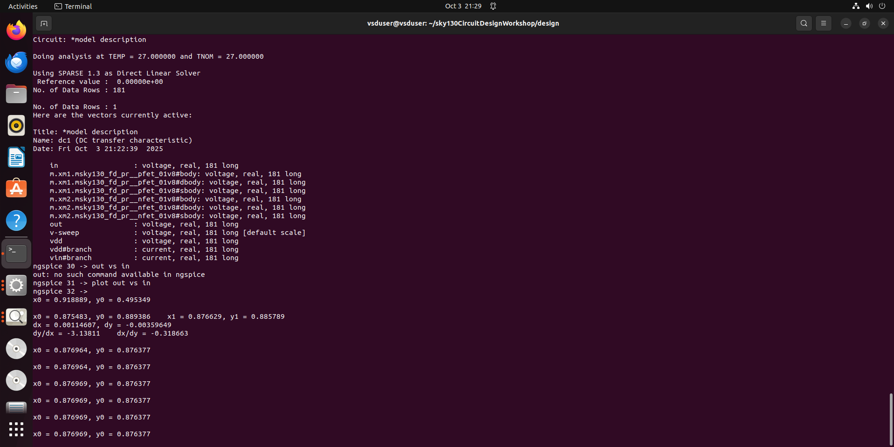
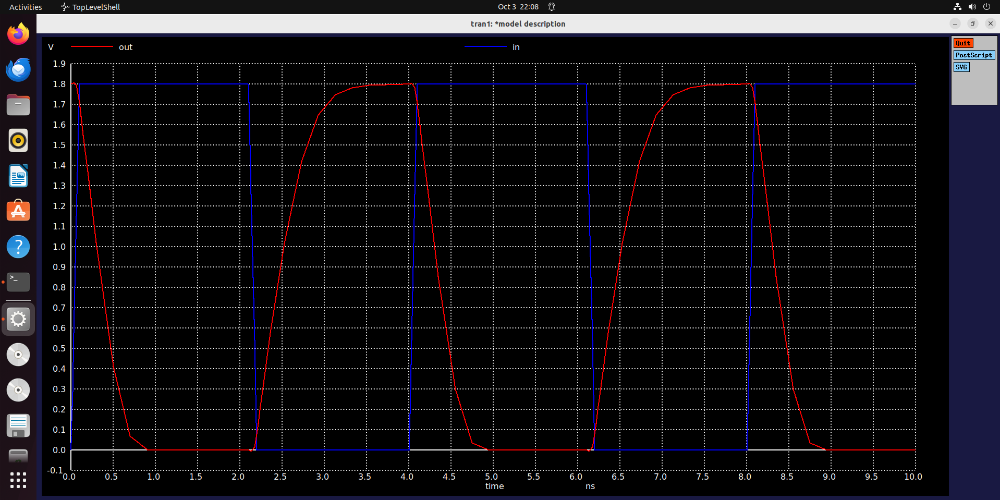
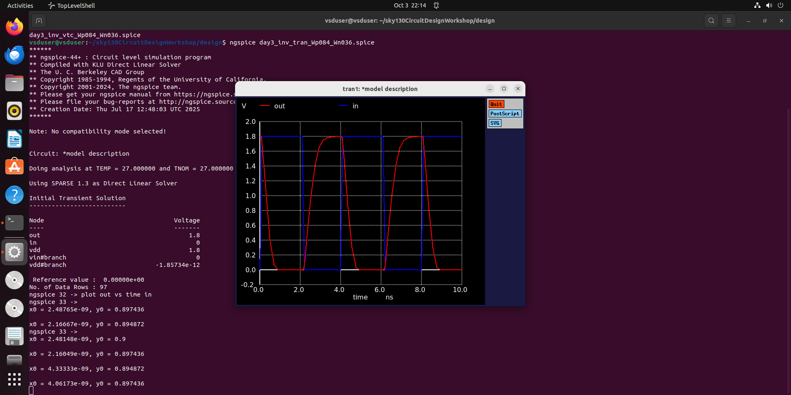

# 📘 CMOS Project – Day 3 Report

Day 3 of the project focused on **CMOS inverter characterization**, analyzing the effect of transistor sizing, identifying the **switching threshold (Vm)**, and performing **delay analysis** using transient simulations. Both theoretical understanding and SPICE simulations were carried out, with supporting plots and graphs.  

---

## 🔹 Effect of PMOS Width on Inverter Characteristics

The lab session began with experiments on the inverter’s **voltage transfer characteristics (VTC)** by varying the width of the PMOS transistor. When the PMOS width was increased, the simulated graphs shifted but their **shapes remained the same**.  

This demonstrated that the **inverter is robust**: its fundamental behavior and characteristics are preserved across different device sizes, even if the curves shift slightly. This robustness is valuable because it means **fabrication variations in transistor sizing do not drastically affect the inverter’s switching behavior**.  

---

## 🔹 Switching Threshold (Vm)

The **switching threshold Vm** is defined as the point where the input voltage (Vin) equals the output voltage (Vout). At this point, the inverter is said to “switch.”  

- At Vm, both **PMOS and NMOS transistors are in saturation**, which allows both devices to conduct simultaneously.  
- In this region, there is a direct path for current to flow from **VDD to GND**, unlike other operating regions where only one device conducts at a time.  
- When Vin = Vout, we observe:  

Using simulation, Vm was determined as a **function of the W/L ratio** of the devices. This relation can also be used in reverse: given a required Vm, the designer can calculate the necessary W/L values. This helps answer a critical design question: **“How much larger should the PMOS be compared to the NMOS?”**  

## 🔹 Delay Analysis

Delay characterization was carried out using **transient analysis** of the inverter. The input and output waveforms were closely examined, zooming in around the 50% transition points.  

- **Rise delay:** measured as the time difference between input and output when both signals cross 50% of their voltage swing on the rising edge.  
- **Fall delay:** measured in the same way but on the falling edge.  

Observations:  
- Rise delay corresponds to the time required to **charge the output capacitor fully**.  
- Increasing the **PMOS size** reduced rise delay, because a wider PMOS has stronger drive capability (lower resistance, higher current).  
- Fall delay is primarily determined by NMOS sizing.  

## 🔹 Key Conclusions

1. Even with significant differences in PMOS and NMOS sizes, the **switching voltage (Vm) changes only minimally**.  
   - This is a desirable property, as it means fabrication errors in transistor sizing will not cause large shifts in inverter threshold.  

2. There exist sizing ratios where **rise delay ≈ fall delay**.  
   - This property is **critical for clock inverters and buffers**, as it ensures symmetry in rising and falling transitions.  
   - Balance is achieved by **making the PMOS larger** until its effective resistance matches that of the NMOS.  

3. Other inverter sizing ratios are still used in specific contexts, depending on design trade-offs.  

## 🔹 Applications

- CMOS inverter sizing plays a crucial role in **clock networks** and in **Static Timing Analysis (STA)**.  
- Balanced rise and fall times are essential in clock buffers to avoid duty-cycle distortion, ensuring reliable operation in high-speed digital systems.  

---

## 🧪 Lab Notes

- SPICE model files were used to simulate CMOS inverter characteristics.  
- VTC curves were generated and analyzed to identify Vm.  
- Transient analysis was performed to measure delay.  
- Zooming into plots (by right-click and drag in the tool) helped measure switching threshold and delay precisely.  

SWITHING THRESHOLD

### Switching Threshold (SPICE Simulation)

### Switching Threshold Values

TRANSIENT ANALYSIS

---

## ✅ Summary

- Studied CMOS inverter VTC with PMOS width variations.  
- Derived switching threshold Vm and linked it to W/L ratios.  
- Performed delay analysis (rise vs fall).  
- Observed that PMOS sizing can balance delays and that inverter behavior is robust across different transistor sizes.  
- Confirmed applications in **clock buffers and STA**.  

---

✨ *End of Day 3 – deeper insights into robust CMOS inverter design and timing analysis!* 🚀
