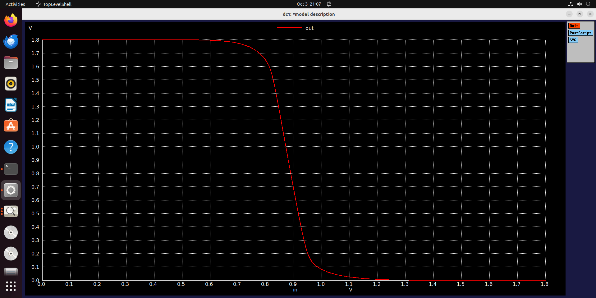
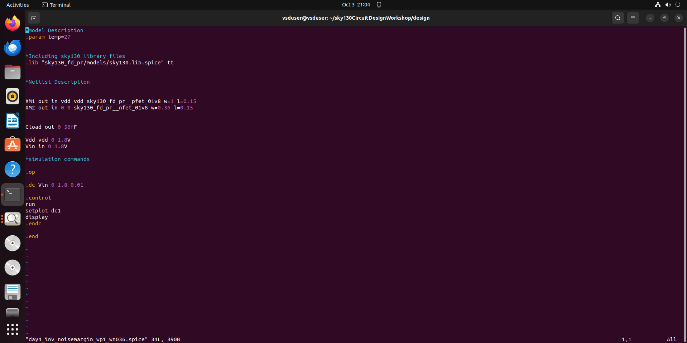
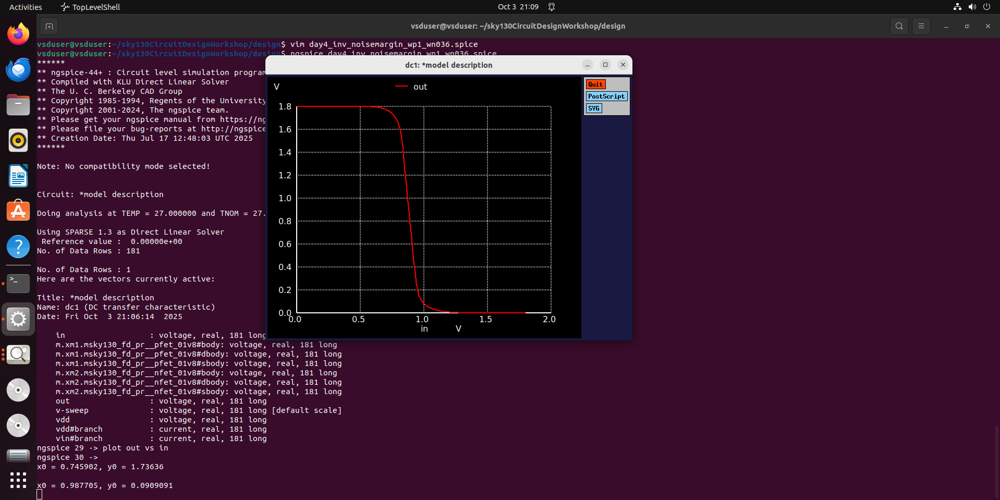

 # 📘 CMOS Project – Day 4 Report  

Day 4 of the project focused on understanding **Noise Margins** in CMOS inverters, their dependence on transistor sizing, and practical SPICE simulations to measure NMH and NML. Both theoretical concepts and lab results were studied to evaluate robustness against noise and fabrication variations.  

---

## 🔹 Noise Margin Basics  

- Noise margin is related to **crosstalk noise** and **glitches** in digital circuits.  
- Defined using VTC (Voltage Transfer Characteristic) curves of the CMOS inverter.  
- Key relationships:  
  - \( V_{OL} < V_{IL} \)  
  - \( V_{OH} > V_{IH} \)  

**How to find noise margin:**  
1. Plot the VTC curve.  
2. Identify the points where the **slope is negative**.  
3. Calculate NMH and NML from these points.  

Example from graph:  
- NMH = \( VOH - VIH = 2.5 - 2.2 = 0.3 \, V \)  
- NML = \( VIL - VOL = 0.3 - 0 = 0.3 \, V \)  

✅ The wider the noise margin region, the better the noise immunity.  
  

---

## 🔹 Interpretation of Noise Margins  

- Voltages between **2.5 V and 2.0 V** → considered as **logic high**.  
- Voltages between **0.3 V and 0 V** → considered as **logic low**.  
- Any noise variation within these windows will still be treated as valid logic 0 or logic 1.  

---

## 🔹 Role of PMOS and NMOS  

- **PMOS**:  
  - Responsible for holding the charge in the load capacitance.  
  - Making PMOS larger → path from supply to load becomes **lower resistance**.  
  - This increases its ability to hold charge longer.  
  - **Inference**: Increasing PMOS width increases **Noise Margin High (NMH)**.  

- **NMOS**:  
  - Responsible for holding logic 0 at the output.  
  - When PMOS is made stronger, NMH increases, but **Noise Margin Low (NML)** reduces.  
  - This happens because the stronger PMOS makes it harder for the weaker NMOS to hold logic 0.  

---

## 🔹 Robustness in Terms of Noise Margin  

- Fabrication variations may cause slight differences in PMOS sizing.  
- This is acceptable because the variation in NMH and NML is typically small (within ~100 mV).  
- Thus, CMOS inverters remain **robust against fabrication errors** in sizing.  

---

## 🔹 Digital vs Analog Perspectives  

- **Digital design**: Noise margins are critical for ensuring reliable **logic 0 and logic 1** states.  
- **Analog design**: Noise margins are more relevant for **amplification purposes**.  

---

## 🧪 Day 4 Lab Results  

- From SPICE simulations:  
  - Noise Margin High = \( VOH - VIH = 0.733 \, V \)  
  - Noise Margin Low = \( VIL - VOL = 0.6549 \, V \)  

---

✨ *End of Day 4 – Key insights into CMOS inverter noise margins and robustness!* 🚀
Day 4 Lab outputs

### Noise Margin Graph

### Noise Margin – SPICE Simulation

### VOH, VIL, and VIH Voltages

## ✅ Summary  

- Noise margins define tolerance to noise and glitches in CMOS inverters.  
- PMOS width directly affects NMH, while NMOS affects NML.  
- Increasing PMOS width strengthens NMH but reduces NML.  
- CMOS inverters are robust even under fabrication variations, with NMH and NML staying within safe ranges.  
- Lab measurements confirmed theoretical calculations with NMH ≈ 0.733 V and NML ≈ 0.6549 V.  
