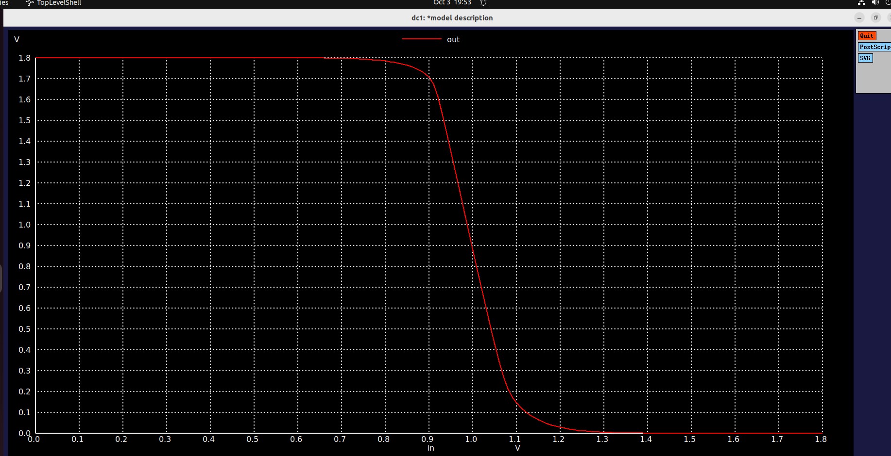
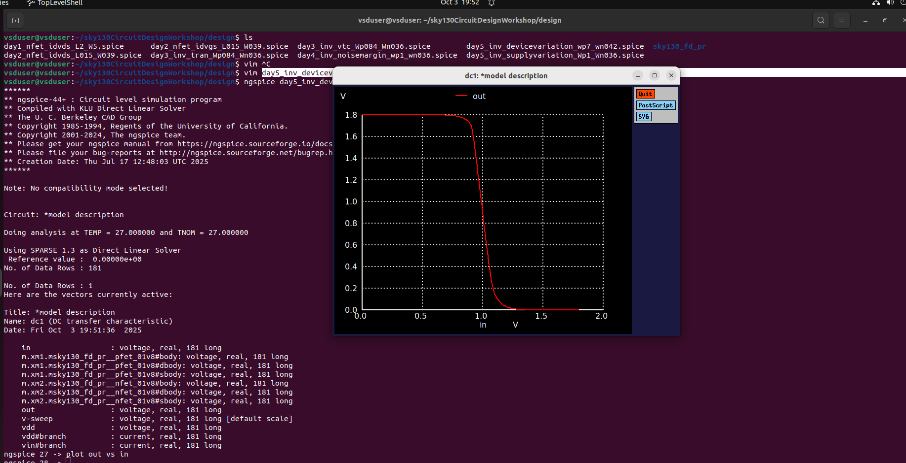
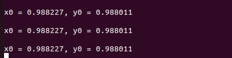
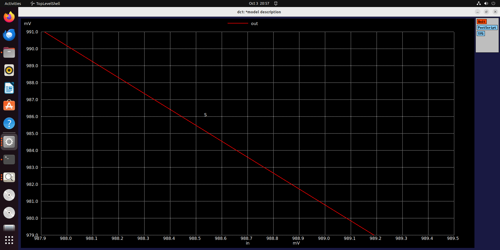

# 📘 CMOS Project – Day 5 Report  

Day 5 of the project focused on the impact of **supply voltage scaling**, the role of **etching process variations**, and robustness of CMOS inverters under extreme transistor sizing conditions. Both theoretical concepts and SPICE simulations were analyzed, with practical lab results.  

---

## 🔹 Power Supply Scaling in CMOS  

- As devices are scaled down, the **power supply voltage is also reduced**.  
- Goal: CMOS inverter behavior should remain **robust** under scaled voltages.  

**Observations:**  
- CMOS inverter must show similar switching behavior even when supply voltage is reduced.  
- If this condition is satisfied, it proves **robustness of CMOS design**.  

---

## 🔹 Gain Under Scaled Voltages  

- **Gain = ΔVout / ΔVin**  
- Observation: **Lower supply voltages give higher gain**.  
  - Small change in input → larger change in output.  
  - Advantageous for **analog engineers** (better amplification).  

---

## 🔹 Energy Dissipation  

- During switching:  
  - Half the energy is dissipated.  
  - Half the energy is lost while changing from logic 1 → logic 0.  

---

## 🔹 Disadvantage of Low Supply Voltage  

- For smaller nodes: charging the same output capacitance requires sufficient supply.  
- At **low supply voltages** (e.g., 1 V):  
  - Rise time insufficient → capacitor not fully charged.  
  - Device becomes **slower**.  
- At **2.5 V supply**: capacitor charges within required time.  
- At **1.0 V supply**: charging takes much longer → slower operation.  

---

## 🔹 Etching Process and Its Effect  

- **Etching defines transistor structure** (width, height, shape).  
- Crucial step in fabrication since **etching affects cell delay**.  
- Different layers represent different metals (red, blue, green, yellow).  

**Impact of Etching:**  
- Determines W and L of transistors.  
  - L = gate length (technology node).  
  - W = gate width (defines overlap area).  
- Inverter chains (data path, clock path, etc.) are affected.  
- Fabrication lab conditions (water, air, gases) can distort etching.  
- Variations in etching accumulate → impact **W/L ratio** and **drain current**.  

---

## 🔹 Variation Across Structures  

- Gates in the middle → relatively uniform structure.  
- Gates at the edges → more distortion (e.g., due to adjacent flip-flops).  
- **Oxide thickness variations**:  
  - Slight in the middle.  
  - Larger at the edges.  
- More oxide variation → more **Id variation**.  

✅ To prove CMOS robustness, inverter must be **least responsive to device variations**.  

---

## 🔹 Strong PMOS and Weak NMOS (and Vice Versa)  

- **Strong PMOS**: wider device, lower resistance.  
- **Weak NMOS**: higher resistance device.  
- Practical assumption:  
  - Max PMOS width = 1.85 μm.  
  - Min NMOS width = 0.375 μm.  

- **Opposite condition** also tested: strong NMOS and weak PMOS.  

---

## 🔹 Extreme Test – Experiment  

Two scenarios:  
1. **DC1:** Strong PMOS, weak NMOS.  
2. **DC2:** Strong NMOS, weak PMOS.  

**Results:**  
- Variation in **switching threshold ~1.2 V**.  
- This is acceptable → behavior remains same.  
- Noise margin also tested:  
  - Even under extreme sizing changes, noise margin area stayed in stable region.  
  - Only small changes observed.  

✅ **Conclusion:** CMOS is robust because it is **not highly responsive** to variations. Operation remains intact.  

---

## 🔹 Why CMOS?  

- CMOS maintains stable operation despite transistor variations.  
- Inverters can be extended to build **logic gates** (NAND, NOR, etc.).  
- This robustness is a key reason for CMOS dominance.  

---

## 🧪 Day 5 Lab  

### Lab (Power Analysis)  
- With supply = 1.0 V and 0.8 V:  
  - Transistors cannot fully turn ON.  
  - Inverter fails to drive PFET/NFET properly.  
  - Gain is insufficient.  

### Lab (Variation Test)  
- Output held high longer than logic zero because **PMOS was larger**.  
- Switching threshold shifted **towards right** when PMOS was bigger.  
  - Earlier threshold ≈ 0.9 V (center).  
  - After PMOS sizing → threshold shifted.  
- **Switching threshold definition**:  
  - Point where Vin = Vout.  

### Input vs Output (Case 1)

### Input vs Output (Case 2)

### Switching Threshold (Basic)

### Switching Threshold (Detailed Graph)

## ✅ Summary  

- Scaling supply voltage changes inverter behavior:  
  - Higher gain at lower supply.  
  - Slower charging of capacitance at low supply.  
- Etching process directly affects **W/L ratio, Id, and delay**.  
- Edge devices in a chain show more variation than middle ones.  
- Extreme tests (strong PMOS vs weak NMOS, and vice versa) confirm **robustness**.  
- CMOS inverters continue to operate correctly even under large device variations.  
- Lab confirmed: supply scaling reduces gain and speed, and PMOS sizing shifts switching threshold.  

✨ *End of Day 5 – proving robustness of CMOS under scaling and fabrication variations!* 🚀

